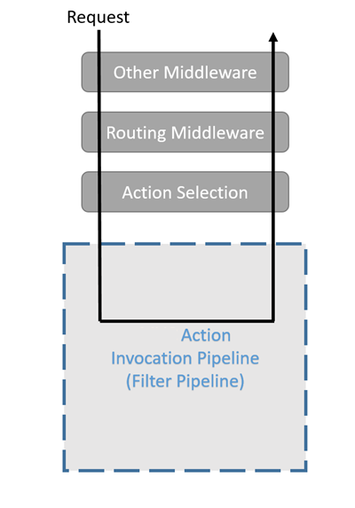
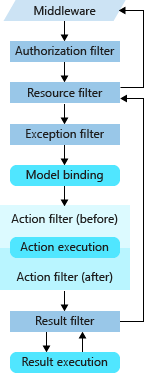

# 筛选器or拦截器or过滤器

1. 通过使用 ASP.NET Core 中的筛选器，可在请求处理管道中的特定阶段之前或之后运行代码。

    - 内置筛选器处理任务，例如：
      - 授权（防止用户访问未获授权的资源）。
      - 响应缓存（对请求管道进行短路出路，以便返回缓存的响应）。
    - 可以创建自定义筛选器，用于处理横切关注点。 横切关注点的示例包括错误处理、缓存、配置、授权和日志记录。 筛选器可以避免复制代码。 例如，错误处理异常筛选器可以合并错误处理。
    - 本文档适用于 Razor Pages、API 控制器和具有视图的控制器。

2. 筛选器的工作原理

    筛选器在 ASP.NET Core 操作调用管道 （有时称为筛选器管道 ）内运行。 筛选器管道在 ASP.NET Core 选择了要执行的操作之后运行。
    

3. 筛选器类型

    - 每种筛选器类型都在筛选器管道中的不同阶段执行：

        - 授权筛选器最先运行，用于确定是否已针对请求为用户授权。 如果请求未获授权，授权筛选器可以让管道短路。
        - 资源筛选器：
            - 授权后运行。
            - OnResourceExecuting 可以在筛选器管道的其余阶段之前运行代码。 例如，OnResourceExecuting 可以在模型绑定之前运行代码。
            - OnResourceExecuted 可以在管道的其余阶段完成之后运行代码。
        - 操作筛选器可以在调用单个操作方法之前和之后立即运行代码。 它们可用于处理传入某个操作的参数以及从该操作返回的结果。 不可在 Razor Pages 中使用操作筛选器 。
        - 异常筛选器用于在向响应正文写入任何内容之前，对未经处理的异常应用全局策略。
        - 结果筛选器可以在执行单个操作结果之前和之后立即运行代码。 仅当操作方法成功执行时，它们才会运行。 对于必须围绕视图或格式化程序的执行的逻辑，它们很有用。
    - 下图展示了筛选器类型在筛选器管道中的交互方式。
    

4. [详情参见（https://docs.microsoft.com/zh-cn/aspnet/core/mvc/controllers/filters?view=aspnetcore-2.2）](https://docs.microsoft.com/zh-cn/aspnet/core/mvc/controllers/filters?view=aspnetcore-2.2)
