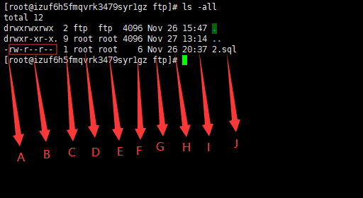

# ls

## ls-all

1. 例子

   

2. 说明

   * A：
      * d：目录
      * -：表示普通文件
      * b：块特殊文件
      * c：字符特殊文件
      * l：符号链接文件
      * p：命名管道文件FIFO
      * s：套接字文件

   * B：
      * 以三个为一组，均为『rwx』的三个参数的组合。其中，[ r ]代表可读(read)、[ w ]代表可写(write)、[ x ]代表可执行(execute)。如果没有权限，就会出现减号[ - ]
      * 第一组为『档案拥有者的权限』，以『install.log』那个档案为例， 该档案的拥有者可以读写，但可执行；第二组为『同群组的权限』；第三组为『其他非本群组的权限』
   * C:
     * 链接占用的节点(i-node)
   * D:
     * 文件所有者
   * E:
     * 文件所有者的用户组
   * F:
     * 文件大小
   * G、H、I:
     * 文件的创建时间/最近修改时间
   * J:
     * 文件名称
