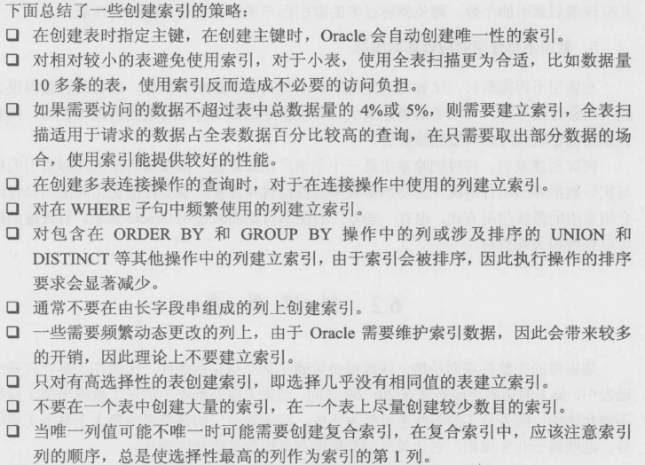

# 索引

## 索引分类

    索引列上划分：
    1、单列索引
    2、多列索引

    列值上划分：
    1、唯一性索引
    2、非唯一性索引

    功能上划分：
    1、标准索引
    2、位图索引
    3、索数索引
    等等

## 创建索引

    CREATE INDEX books_index ON books(book_name);

    创建复合索引
    CREATE INDEX books_index ON books(book_name,author);

## 修改索引

### 重命名索引

    ALTER INDEX index_books RENAME TO index_new_books;

## 重建和合并索引

    索引使用一段时间后，根据其使用频率，比如增加、修改和删除操作的次数，在索引段中可能会产生大量的碎片，从而降低索引的使用效率。可以使用一下两种方式进行索引碎片整理。
    1、合并索引
    ALTER INDEX index_books COALESCE;
    2、重建索引
    ALTER INDEX index_books REBUILD;

## 删除索引

    DROP INDEX index_books

## 索引的使用策略

