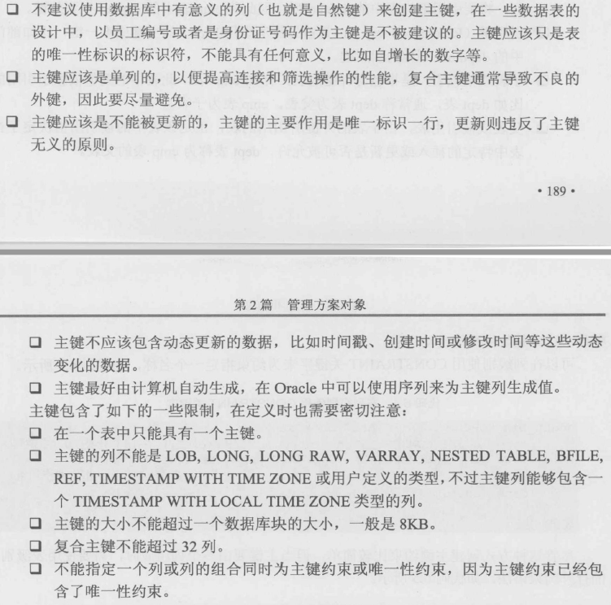

# 约束

## 约束分类

    1. 非空约束    NOT NULL
    2. 唯一性约束  UNIQUE
    3. 主键约束    PRIMARY KEY
    4. 外键约束
    5. 检查约束

## 创建约束

### 创建主键约束

    CREATE TABLE books
    (
        id int PRIMARY KEY
    );

    CREATE TABLE books
    (
        id int CONSTRAINTS pk_book_id PRIMARY KEY
    );

    CREATE TABLE books
    (
        id int,
        name varchar2(50)
        CONSTRAINT pk_book PRIMARY KEY(id,name)  --指定复合主键
    );

#### 创建主键的一些常用规则

### 创建外键约束

    DROP TABLE books
    (
        book_id INT CONSTRAINT pk_book_id PRIMARY KEY,
        book_name VARCHAR2(50),
        cate_id INT,
        CONSTRAINT fk_cate_id FOREIGN KEY (cate_id) REFERENCES book_category(cate_id)  --定义外键约束
    )

    DROP TABLE books
    (
        book_id INT CONSTRAINT pk_book_id PRIMARY KEY,
        book_name VARCHAR2(50),
        cate_id INT,
        CONSTRAINT fk_cate_id FOREIGN KEY (cate_id) REFERENCES book_category(cate_id) ON DELETE CASCADE --定义外键约束并指定级联删除，在category中删除记录时，books表中的引用category的值的那一条记录会被删除
    )

    DROP TABLE books
    (
        book_id INT CONSTRAINT pk_book_id PRIMARY KEY,
        book_name VARCHAR2(50),
        cate_id INT,
        CONSTRAINT fk_cate_id FOREIGN KEY (cate_id) REFERENCES book_category(cate_id) ON DELETE SET NULL --定义外键约束并指定级联置空，在category中删除记录时，books表中的引用category的值会被置空
    )

### 创建检查约束

    CREATE TABLE books
    (
        book_id INT PRIMARY KEY,
        book_name VARCHAR2(200) CHECK(LENGTH(book_name<100)),
        book_count NUMBER(9,2) CHECK(book_count>0 AND book_count<=5000)
    )

    CREATE TABLE books
    (
        book_id INT PRIMARY KEY,
        book_name VARCHAR2(200),
        book_count NUMBER(9,2),
        CONSTRAINT check_book_name CHECK (book_name=UPPER(book_name)),
        CONSTRAINT check_book_name CHECK (book_count BETWEEN 1 AND 1000)
    )
    注意：
    如果CHECK的计算结果为TRUE或未知值（如NULL），将会被认为是匹配CHECK约束条件，因此要注意CHECK的检查结果是否为NULL值而导致通过验证。

### 唯一性约束

    CREATE TABLE books
    (
        book_id INT PRIMARY KEY,
        book_name VARCHAR2(200),
        ISBN VARCHAR2(50) UNIQUE
    )

    CREATE TABLE books
    (
        book_id INT PRIMARY KEY,
        book_name VARCHAR2(200),
        isbn VARCHAR2(50),
        CONSTRAINT unq_isbn UNIQUE(isbn)
    )

    CREATE TABLE books
    (
        book_id INT PRIMARY KEY,
        book_name VARCHAR2(200),
        isbn VARCHAR2(50),
        CONSTRAINT unq_name_isbn UNIQUE(book_name,isbn)
    )

## 修改约束

### 添加约束

    ALTER TABLE books ADD CONSTRAINT pk_book PRIMARY KEY (book_id);

### 禁用约束

    ALTER TABLE books ADD CONSTRAINT unq_book_name UNIQUE(book_name) DISABLE;

### 启用约束

    ALTER TABLE books ENABLE NOVALIDATE CONSTRAINT unq_book_name;

### 重命名约束

    ALTER TABLE books RENAME CONSTRAINT unq_book_name TO unq_new_book_name;

### 删除约束

    ALTER TABLE books DROP CONSTRAINT unq_book_name;
